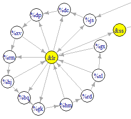

## Part 2

I solved this by inspection and am not sure how to do it generically.

If you look at the graph of the modules (broadcast/output in red, all conjunctions in yellow).
(Can't get it to lay out all that nice).

* The output node `Orx` is fed by `&ql`, a conjunction
* `&ql` is fed by four inverters `fh`, `mf`, `ss`, `fz` which much each send HIGH for `ql` to send LOW to `rx`
* each of these inverters must be sent LOW in order to send out that HIGH
* These inverters are fed by one conjunction each: `&mf`, `&lr`, `&tf`, `&sn`
* These are the only outputs from each of the 4 sub-graphs, so each of the 4 sub-graphs can be considered independently!

The question becomes:: **on what iterations will each of the sub-graph conjunctions (mf/lr/tf/sn) emit a LOW?**
Then when these all do it simultaneously (the lowest common multiple), you that's the answer I want.

So let's consider one sub-graph and its central conjunction `&lr`::

It is fed by 12 flipflips, which must all send HIGH in order for `&lr` to send a LOW.

> Key information:: Flipflops send a LOW when they turn OFF, and they turn OFF every **second** LOW 
they receive (assuming they start OFF). So a flipflop emits a LOW pulse every second LOW it receives.

* The "first" flipflop `%js` is connected to BROADCAST and receives a LOW every button-push.
  Therefore it toggles between ON and OFF every button push.
    * It sends LOW every 2nd button push (high/low/high/low/high/low/...)
    * It sends HIGH every 2nd button push from the 1st
* The "second" flipflop `%dc` feeds from `%js`. It receives a LOW every second iteration, and
  sends a low every second low it receives. Its state (including the initial)
    * OFF OFF ON ON OFF OFF ON ON ...
    * i.e. it sends a low every 4th button push.
    * It sends HIGH every 4th button push from the 2nd
* The "third" flipflop `%dp` feeds from `%dc`. It receives a LOW every fourth iteration, and sends a LOW
  every second LOW it receives.
    * OFF OFF OFF OFF ON ON ON ON OFF OFF OFF OFF ON ON ON ON ...
    * i.e. it sends a low or high every 8th button push.
    * the first high is on the 4th button push..

And so on - if you go round the chain of flipflops (all 12 of them), the last one `%gx% will not send a LOW until the

Considering `&lr`, only some of these flipflops feed it:: `js`, `xv`, `hj`, `hm`, `rd`, `xl`, `gx`.
These must ALL send HIGH simultaneously for `&lr` to send the LOW.

The periods are:

|flipflop| period | first HIGH |
|-------:|--------|------------|
|js| 2    | 1 = 2^0 |
|xv| 2^4  | 8 = 2^3 |
|hj| 2^6  | 2 ^ 5   |
|hm| 2^9  | 2 ^ 8   |
|rd| 2^10 | 2 ^ 9   |
|xl| 2^11 | 2 ^ 10  |
|gx| 2^12 | 2 ^ 11  |

If you add these up you get 3881, and if you push the button 3881 times, it seems that `&lr` sends the LOW then
 (or maybe on the 3880'th push, unsure).
In any case, the cycle length is 3881.

(
Why is it the SUM of these numbers and not the LCM? Not sure.
Maybe because on the LCM - 2048/`gx`'s first HIGH - `js` will have sent a LOW and you need to
wait for them to go one more cyel to send the HIGH again? Not entirely sure.
)

What's cool is if by inspection you start from `js` and write down a 1 if it feeds in to `&lr` and 0 otherwise,
 and read this number in little-endian order::

|js|dc|dp|xv|rm|hj|bq|gk|hm|rd|xl|gx|
|--|--|--|--|--|--|--|--|--|--|--|--|
|1 |0|0|1|0|1|0|0|1|1|1|1|

Convert this to a binary (little-endian.. so it's actually 111100101001) you get ... 3881. Cool!
Which makes sense given the `first HIGH` of the table 2 before.

In any case, doing the 1/0 thing on each of the sub-graphs provides

* `&lr`: 111100101001 -> 3881
* `&hl`: 111010110001 -> 3761
* `&tf`: 111011010001 -> 3793
* `&sn`: 111100000111 -> 3847

If you take the LCM of these things you get 212986464842911 which is the answer.
I don't _quite_ understand why I didn't subtract 1 from everything but oh well.

¯\_(ツ)_/¯ 

Also if you plot state-history (flipflops have ON=TRUE, OFF=FALSE; conjunction mapped to
AND(all inputs)), with iterations increasing horizontally and modules listed vertically...
you get a cool Christmassy colour.

And if you look at say just one of the sub-graphs

You can see the irregularity to the RHS where the pattern is interrupted, this is the 3761'th state including
 the 0th (cycle length) and is what led me to thinking about this.
