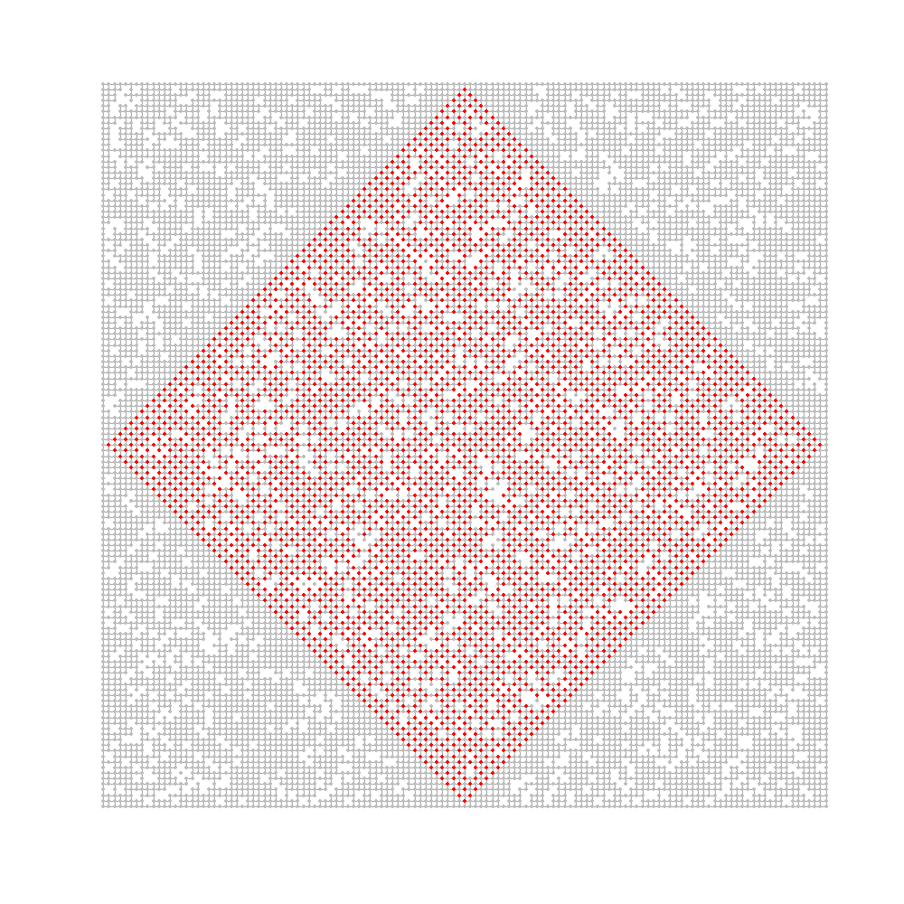
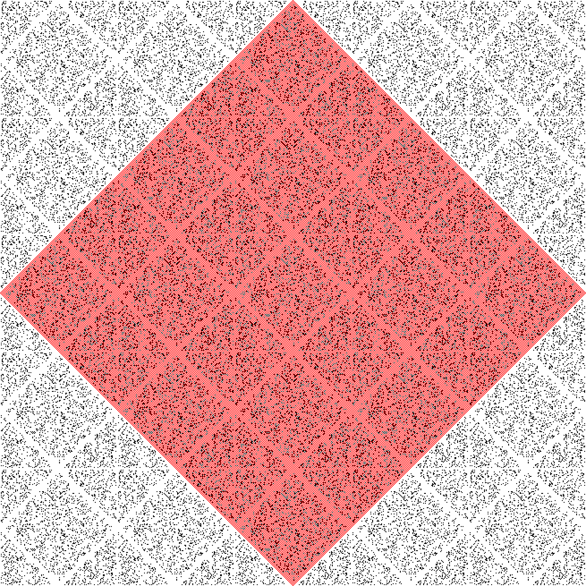

Here is a picture of nodes visited in part 1.

But at the end of the day if you plot (x=number of steps, y=number of plots visited) it looks quadratic.
So I just fitted a quadratic to my data and predicted it out to the right number of steps ¯\_(ツ)_/¯ 

I think the way you are supposed to do it, is get your answer on a 5x5 tiling, and this gives you 9 different "types" of tile:

* 4 corners
* 4 diagonal edges
* 1 full inner tile (or maybe 2, not sure)

Calculate the `n` for each tile and then extrapolate out to however many tiles you need.

It works because the input data has a clear corridor all the way to the edge (so 131 steps always gets you from the edge of one tile to the edge of the next), the requested number of steps is `(centre to edge) + n*(tile length)`. And they've cleared the diamond shape so that there aren't even any edge effects.

Ahhh - this makes it a bit clearer

