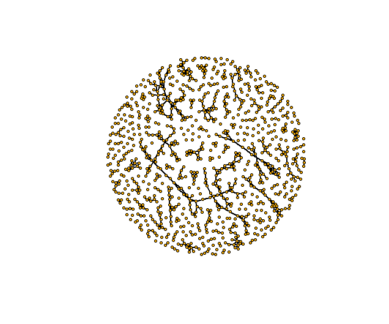
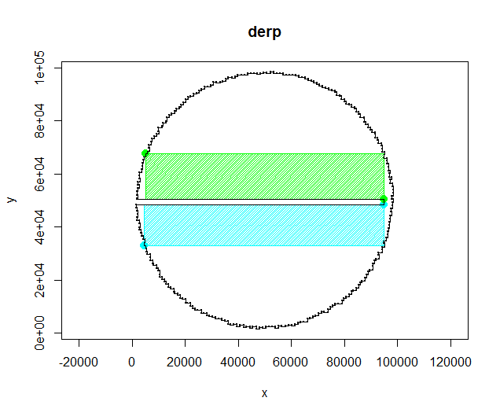
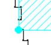
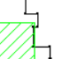
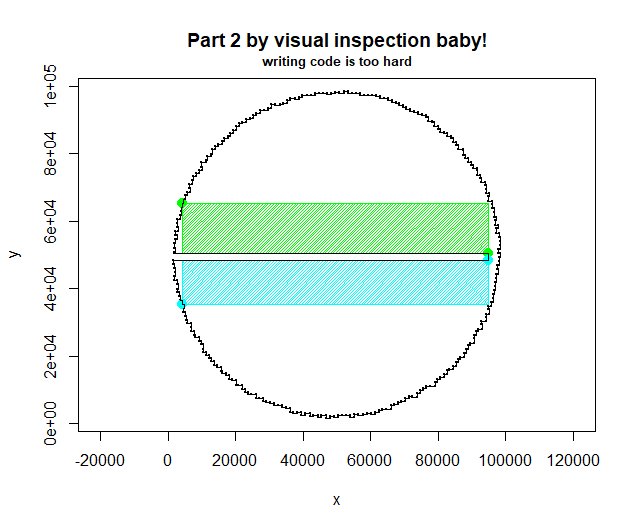
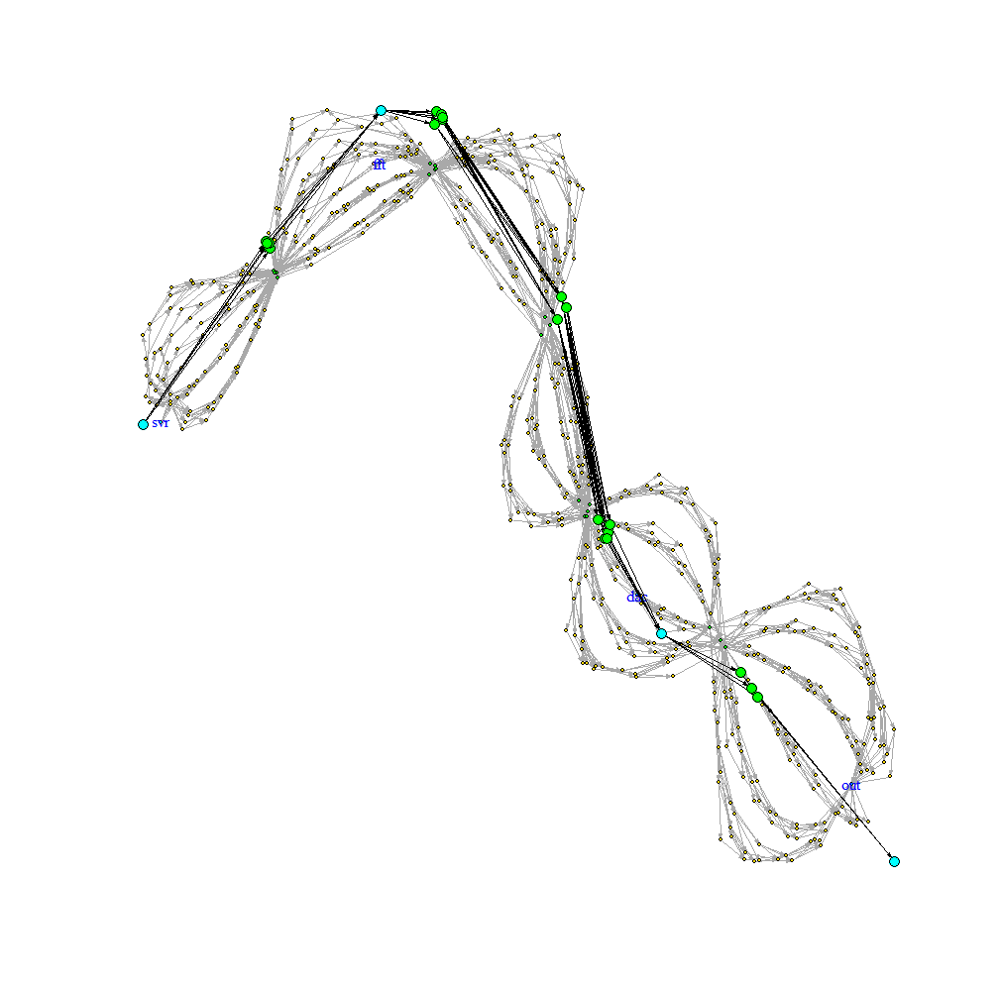
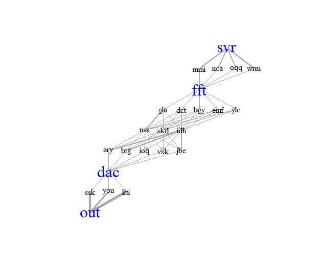

# 2025

Language: R. Too lazy to learn IO in other languages.

Biggest lesson: don't try to be mathsy smart, just write the for loop :(
 

| Day | Comment                                                                                                                                      |
|----:|----------------------------------------------------------------------------------------------------------------------------------------------|
|  01 | Really struggled - spent ages trying to do it 'smart' but hours later, the nasty for-loop was the answer :(                                  |
|  02 | Also over-thought this, should have done it a bit 'dumber' and better. (Don't use formulae: just chop the number into bits to determine the lengths!) |
|  03 | phew, managed this one pretty easy                                                                                                           |
|  04 | straightforward but my code was super slow                                                                                                   |
|  05 | spent way too long writing a "reduce overlapping intervals" function but then read another implementation which was way simpler lol          |
|  06 | I enjoyed the story of part 2.                                                                                                               |
|  07 | I hate these beam-splitter ones. And recursive stuff. That was hard, but I made a cute picture. |
|  08 | Thought I misread the problem in part1 and spent ages coding up something with the new logic then realised I was right all along and had just typo'd |
|  09 | Cheesed part 2 by VISUAL INSPECTION AND TRIAL AND ERROR YEAHHHHH |
|  10 | ahh, the AoC question where you seem to have to use lpsolve, i.e. not a programming problem |
|  11 | Quite frustrating - mashed away for 5h and came up with something workable but had a typo and couldn't work it out. Then realised that my day7 code AS-IS would solve parts 1 and 2 instantly. :( |

### Day 7

### Day 8

### Day 9
#### initial attempt  

#### Oopsies  

#### Got it right this time  

### Day 11

#### My input next to a simplified version

#### Simplified version, edge weights ~ sqrt(num paths on original graph)

